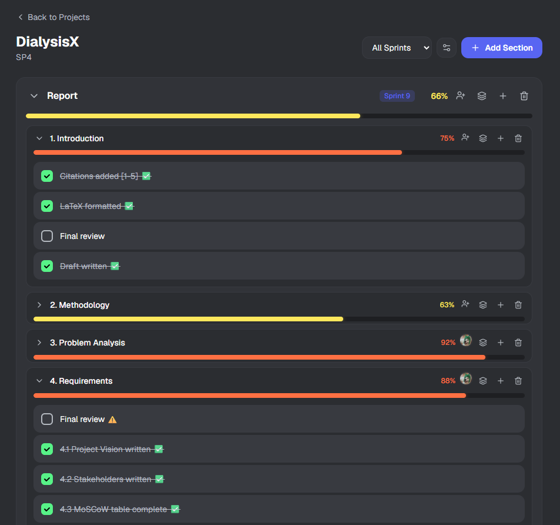

<div align="center">

# Checklist Bot

**Task management web app for Discord teams**


[](https://checklist-bot-production-2df8.up.railway.app/)

</div>

---



---

## Overview

Checklist Bot is a web-based task management app built for Discord servers. Sign in with your Discord account and organize your team's work into hierarchical projects, sections, and subsections — with tasks assignable to multiple members, real-time progress tracking, and sprint support.

A companion Discord bot mirrors the web interface, letting your team manage tasks directly from any channel.

## Features

- **Discord OAuth** — sign in with your Discord account via NextAuth
- **Hierarchical structure** — projects → sections → subsections → tasks
- **Multi-member assignment** — assign tasks to one or more server members
- **Progress tracking** — real-time completion percentages per section and sprint
- **Sprint support** — organize work into time-boxed sprints
- **Discord bot** — companion Python bot for in-channel task management

## Stack

| Layer | Technology |
|-------|-----------|
| Framework | Next.js 16 (App Router) |
| Auth | NextAuth v4 · Discord OAuth |
| Database | Supabase (PostgreSQL) |
| Styling | Tailwind CSS |
| Bot | Python |

## Local Development

```bash
# Install dependencies
npm install

# Set up environment variables
cp .env.example .env.local
# Fill in: NEXTAUTH_SECRET, DISCORD_CLIENT_ID, DISCORD_CLIENT_SECRET, SUPABASE_URL, SUPABASE_ANON_KEY

# Run dev server
npm run dev
```

Open [http://localhost:3000](http://localhost:3000).

## Environment Variables

```env
NEXTAUTH_URL=http://localhost:3000
NEXTAUTH_SECRET=
DISCORD_CLIENT_ID=
DISCORD_CLIENT_SECRET=
NEXT_PUBLIC_SUPABASE_URL=
NEXT_PUBLIC_SUPABASE_ANON_KEY=
```

---

<div align="center">
  <a href="https://checklist-bot-production-2df8.up.railway.app/">Live ↗</a> · <a href="https://github.com/DavidSerret">@DavidSerret</a>
</div>
